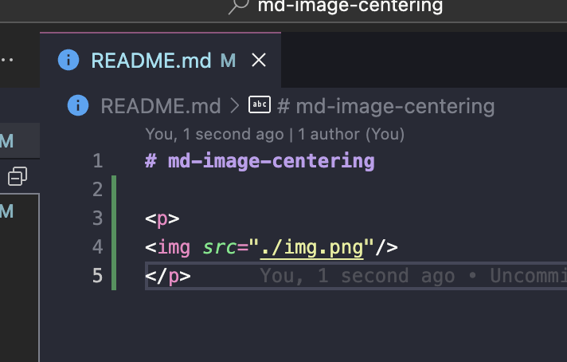

# md-image-centering

without picture

 
<em>test</em>

with picture

<picture>

</picture>
 
<em>test</em>

using picture

    <picture>
        
    </picture> 
    <em>Test</em>

using text-align and picture

    <picture>
        
    </picture> 
    <em>Test</em>

